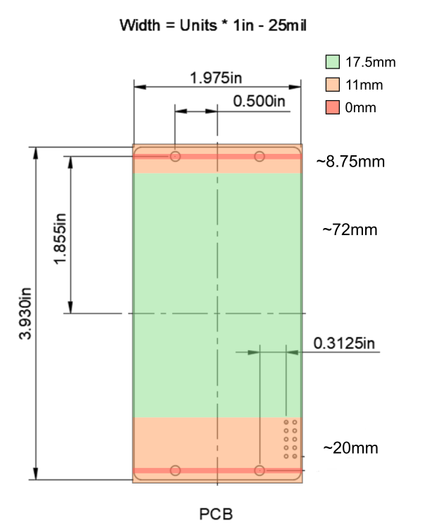

Introduction of the Quickswap Case lead to some incompatibilities. These are/were tracked here:

[Quickswap Incompatibility List](https://docs.google.com/spreadsheets/d/1jSNrufBEWKZQI-RxFEHjsJ9Qpmhe9J_oeXGwnqDRdbQ/edit?pli=1&gid=0#gid=0)

To be Quickswap Case compatable, modules must respect the "Keepout Zones".

The specification of the module dimensions supported by the Quickswap Case is available [here](QuickswapCaseModuleDimensions.pdf).